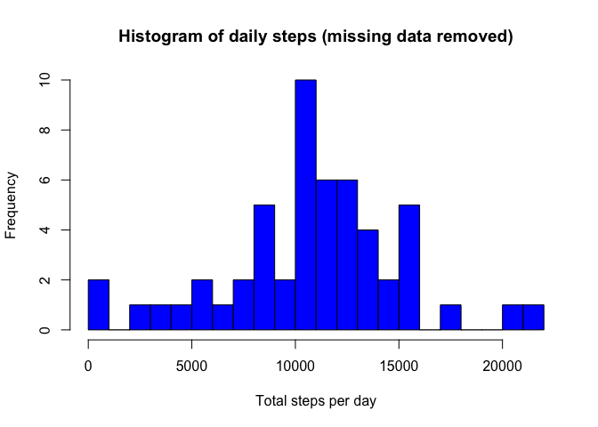
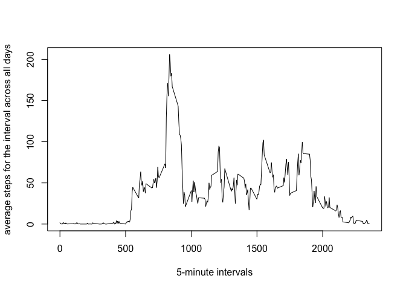
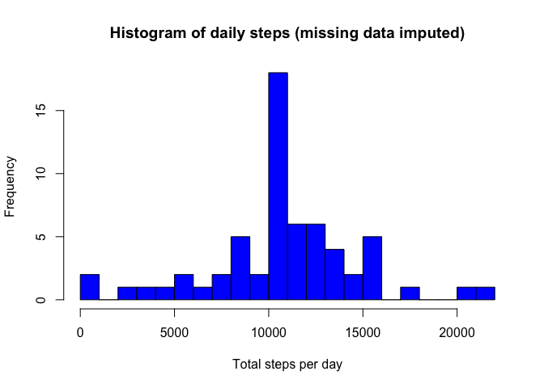

# Reproducible Research: Peer Assessment 1


## Loading and preprocessing the data

First we load the data using the read.csv function, and use summary(), str() and head() to get an idea of the content of the data:


```r
sourcefile <- "activity.csv"
df <- read.csv(sourcefile)
summary(df)
```

```
##      steps                date          interval     
##  Min.   :  0.00   2012-10-01:  288   Min.   :   0.0  
##  1st Qu.:  0.00   2012-10-02:  288   1st Qu.: 588.8  
##  Median :  0.00   2012-10-03:  288   Median :1177.5  
##  Mean   : 37.38   2012-10-04:  288   Mean   :1177.5  
##  3rd Qu.: 12.00   2012-10-05:  288   3rd Qu.:1766.2  
##  Max.   :806.00   2012-10-06:  288   Max.   :2355.0  
##  NA's   :2304     (Other)   :15840
```

```r
str(df)
```

```
## 'data.frame':	17568 obs. of  3 variables:
##  $ steps   : int  NA NA NA NA NA NA NA NA NA NA ...
##  $ date    : Factor w/ 61 levels "2012-10-01","2012-10-02",..: 1 1 1 1 1 1 1 1 1 1 ...
##  $ interval: int  0 5 10 15 20 25 30 35 40 45 ...
```

```r
head(df)
```

```
##   steps       date interval
## 1    NA 2012-10-01        0
## 2    NA 2012-10-01        5
## 3    NA 2012-10-01       10
## 4    NA 2012-10-01       15
## 5    NA 2012-10-01       20
## 6    NA 2012-10-01       25
```
We need to do a bit of preprocessing:

1. The dates should be in date format;
2. We can get rid of rows with missing values to make the next steps easier (although we keep the original data frame for use later).


```r
df$date <- as.Date(df$date)
df_no_na <- subset(df, !is.na(df$steps))
```

## What is mean total number of steps taken per day?

First we create the histogram:


```r
dailysteps <- tapply(df_no_na$steps, df_no_na$date, sum,
                     na.rm = TRUE, simplify = TRUE)

hist(dailysteps,
     col = "blue",
     breaks = 30,
     xlab = "Total steps per day",
     ylab = "Frequency",
     main = "Histogram of daily steps (missing data removed)")
```

<!-- -->

Now we report the mean and median.


```r
paste("The mean is", mean(dailysteps))
```

```
## [1] "The mean is 10766.1886792453"
```

```r
paste("The median is", median(dailysteps))
```

```
## [1] "The median is 10765"
```

The mean is the same but the median has now increased slightly to the same value as the mean. This makes sense: we've replaced more than 10% of our step data with the mean value for those intervals, so it's no surprise that the median value is now the same as the mean!

The effect on our data is clear from the histogram: the height of the central bars (i.e. the mean) is much greater.

## What is the average daily activity pattern?

To look at the daily pattern we make a time series plot of the 5-minute interval (x-axis) and the average number of steps taken, averaged across all days (y-axis)


```r
intvl_avg <- tapply(df_no_na$steps, df_no_na$interval, mean,
                    na.rm = TRUE, simplify = TRUE)
df_intavg <- data.frame(interval = as.integer(names(intvl_avg)),
                        avg = intvl_avg)
with(df_intavg,
     plot(interval,
          avg,
          type = "l",
          xlab = "5-minute intervals",
          ylab = "average steps for the interval across all days"))
```

<!-- -->

We can see from the plot that the peak is somewhere c. 800-900. Let's find out where:


```r
interval_peak <- max(df_intavg$avg)
df_intavg[df_intavg$avg == interval_peak, ]
```

```
##     interval      avg
## 835      835 206.1698
```

So the interval with the highest steps is 835, with 206 steps.

## Imputing missing values

First we check how many rows there are with missing data.


```r
sum(is.na(df$steps))
```

```
## [1] 2304
```

So we have 2,304 rows with missing data.

The strategy I will use is to substitute the mean value for a given interval for any missing values. Now I will create a dataset `df_imputed` using that strategy.


```r
df_imputed <- df
no_data <- is.na(df_imputed$steps)
df_imputed$steps[no_data] <- intvl_avg[as.character(df_imputed$interval[no_data])]
sum(is.na(df_imputed$steps))
```

```
## [1] 0
```

That last line confirms that we've eliminated all of the missing values. Now let's make a new histogram using this `df_imputed` data frame.


```r
dailysteps_imputed <- tapply(df_imputed$steps,
                             df_imputed$date,
                             sum,
                             na.rm = TRUE,
                             simplify = TRUE)

hist(dailysteps_imputed,
     col = "blue",
     breaks = 30,
     xlab = "Total steps per day",
     ylab = "Frequency",
     main = "Histogram of daily steps (missing data imputed)")
```

<!-- -->

And let's check the mean and median.


```r
paste("The mean is now", mean(dailysteps_imputed))
```

```
## [1] "The mean is now 10766.1886792453"
```

```r
paste("The median is now", median(dailysteps_imputed))
```

```
## [1] "The median is now 10766.1886792453"
```

## Are there differences in activity patterns between weekdays and weekends?

First we need to create a factor variable that will allow us to distinguish between weekdays and weekends.


```r
is_weekday <- function(d) {
    wd <- weekdays(d)
    ifelse (wd == "Saturday" | wd == "Sunday", "weekend", "weekday")
}

wx <- sapply(df_imputed$date, is_weekday)
df_imputed$wk <- as.factor(wx)
head(df_imputed)
```

```
##       steps       date interval      wk
## 1 1.7169811 2012-10-01        0 weekday
## 2 0.3396226 2012-10-01        5 weekday
## 3 0.1320755 2012-10-01       10 weekday
## 4 0.1509434 2012-10-01       15 weekday
## 5 0.0754717 2012-10-01       20 weekday
## 6 2.0943396 2012-10-01       25 weekday
```

Now we Make a panel plot containing a time series plot of the 5-minute interval (x-axis) and the average number of steps taken, averaged across all weekday days or weekend days (y-axis).


```r
wk_df <- aggregate(steps ~ wk + interval, 
                   data = df_imputed, 
                   FUN = mean)

library(lattice)
xyplot(steps ~ interval | factor(wk),
       layout = c(1, 2),
       xlab="Interval",
       ylab="Number of steps",
       type="l",
       lty=1,
       data=wk_df)
```

<!-- -->
